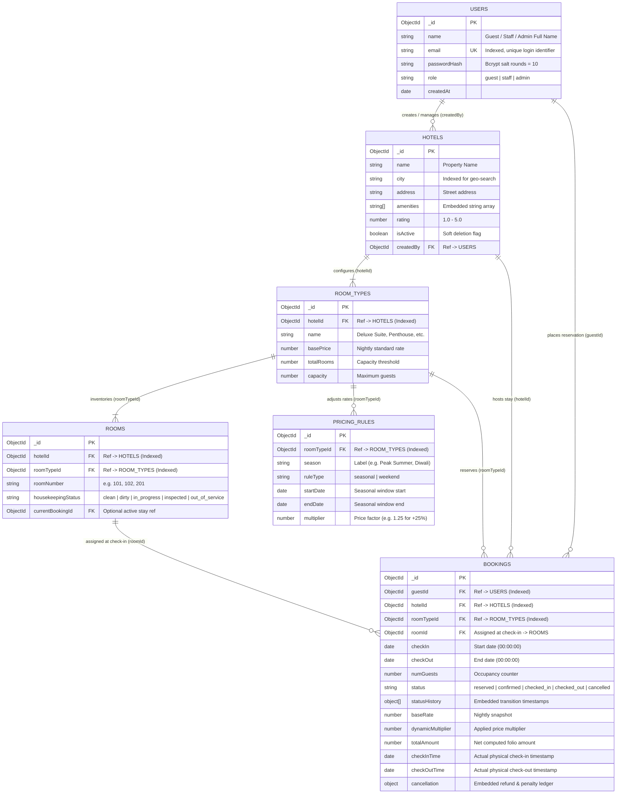

# Grand Horizon — Hotel Room Booking & Reservation Platform

[](https://nodejs.org/)
[](https://expressjs.com/)
[](https://www.mongodb.com/)
[](https://mongoosejs.com/)
[](https://jwt.io/)
[](https://github.com/annmary-aaa/hotel-booking-platform)
[](#team-details)

> **Continuous Internal Assessment – 3 (CIA-3) Final Project**  
> **Course:** Advanced JavaScript Backend Frameworks (Node.js & Express JS)  
> **Institution:** Christ University, Department of Computer Science and Engineering  
> **Project Code & Title:** **P03 — Hotel Room Booking & Reservation Platform**  
> **Domain:** Hospitality & Multi-Property Yield Management  

---

## Mandatory Team Details Page

*Submitted in compliance with Section 3 of the CIA-3 Project Development & Submission Guidelines:*

| S.No | Student Name | Roll No. | Department | Section / Batch |
|:---:|:---|:---:|:---:|:---:|
| **1** | **Ann Mary Johnson** | 2462039 | ADSE | 5BTCSAIML B |
| **2** | **Anki Pai** | 2462036 | ADSE | 5BTCSAIML B |
| **3** | **Allen Prem Varghese** | 2462030 | ADSE | 5BTCSAIML B |
| **4** | **Ronit Anegundi** | 2462188 | ADSE | 5BTCSAIML B |

---

## Executive Summary & Business Overview

**Grand Horizon** is an enterprise-grade backend platform built for a boutique luxury hotel chain managing multiple properties across diverse metropolitan and resort destinations. 

Modern hospitality businesses require real-time room inventory management, strict double-booking prevention under concurrent traffic, dynamic weekend and seasonal yield pricing, role-separated front desk workflows, and aggregation-driven executive analytics. This system implements a robust, secure, and production-ready RESTful architecture adhering to corporate standards.

### Key Capabilities
- **ACID Double-Booking Prevention:** Non-conflicting interval overlap algorithms (`checkIn < reqEnd && checkOut > reqStart`) evaluate real-time capacity before confirming reservations.
- **Dynamic Pricing Engine:** Multi-tier seasonal overlays and weekend surge multipliers dynamically calculate nightly stay rates.
- **Strict Role-Based Access Control (RBAC):** Cryptographically enforced JWT authentication partitioning public users, verified **Guests**, front desk **Staff**, and property **Admins**.
- **Front Desk Workflow Automation:** Enforces room inspection prerequisites prior to check-in and automatically flags rooms as `dirty` upon checkout.
- **Tiered Refund & Cancellation Policy:** Automatic schedule-dependent refund calculation based on proximity to check-in.
- **Itemized Folio Generation:** Dynamically computed invoices accounting for base rates, seasonal adjustments, and statutory GST.
- **Aggregated Property Analytics:** MongoDB aggregation pipelines deliver real-time occupancy percentages and revenue summaries.
- **Boutique Luxury Web Interface:** A lightweight, vanilla JavaScript/CSS client styled with a warm cream/espresso luxury aesthetic, bespoke SVG iconography, and zero external frontend dependencies.

---

## Architecture & Database Design

The system follows an MVC (Model-View-Controller) layered architecture with centralized error dispatch, Joi validation pipelines, and strict separation between transactional database operations and business logic.

### Entity-Relationship (ER) Diagram



### Collection Design & Schema Optimization

| Collection | Key Fields | Indexing Strategy | Architecture Rationale |
|---|---|---|---|
| **`users`** | `name`, `email`, `passwordHash`, `role` | `{ email: 1 }` (Unique) | Enforces account uniqueness and provides $O(1)$ lookups during JWT login. |
| **`hotels`** | `name`, `city`, `amenities[]`, `rating`, `isActive` | `{ name: 1 }`, `{ city: 1 }` | Powers rapid filtering on location search and admin dashboards. `amenities` is embedded as it is always read with property metadata. |
| **`roomTypes`** | `hotelId`, `name`, `basePrice`, `totalRooms`, `capacity` | `{ hotelId: 1 }` | Optimized for frequent "fetch room types by hotel" queries. |
| **`rooms`** | `roomTypeId`, `hotelId`, `roomNumber`, `housekeepingStatus` | `{ roomTypeId: 1 }`, `{ hotelId: 1 }` | Enables fast staff lookups for clean rooms during guest check-in. |
| **`bookings`** | `guestId`, `hotelId`, `roomTypeId`, `roomId`, `checkIn`, `checkOut`, `status` | `{ guestId: 1 }`, `{ hotelId: 1 }`, `{ checkIn: 1, checkOut: 1 }` | Compound and single indexes optimize overlap checks and guest history queries. `statusHistory` is embedded for audit traceability. |
| **`pricingRules`**| `roomTypeId`, `season`, `ruleType`, `multiplier` | `{ roomTypeId: 1 }` | Fast retrieval during dynamic rate computation at reservation and search time. |

---

## 13 Assessment Functional Modules Matrix

All 13 mandatory functional modules specified in the assessment guidelines are fully implemented and verified:

| # | Assessment Module | Primary Endpoints | Access Role | Business Logic & Implementation Highlights |
|:---:|:---|:---|:---:|:---|
| **1** | **Guest Registration & Authentication** | `POST /api/auth/register`<br>`POST /api/auth/login`<br>`GET /api/auth/me` | Public / Bearer Token | Bcrypt password hashing (10 salt rounds). Issues standard signed JWTs containing `id` and `role`. Enforces RBAC with `auth` and `restrictTo` middleware. |
| **2** | **Hotel & Property Management** | `POST /api/hotels`<br>`GET /api/hotels`<br>`GET /api/hotels/:id`<br>`PUT /api/hotels/:id`<br>`DELETE /api/hotels/:id` | Admin / Public | Multi-property management. Admin can create, update, and soft-delete properties. Supports embedded amenities filtering and pagination. |
| **3** | **Room Type & Inventory Management** | `POST /api/room-types`<br>`GET /api/room-types`<br>`POST /api/rooms`<br>`GET /api/rooms` | Admin / Staff / Public | Defines room categories with pricing and physical inventory. Creating a room type automatically provisions physical room entities (`Room 101`, `Room 102`, etc.). |
| **4** | **Availability Search Engine** | `GET /api/hotels/search` | Public | Real-time interval overlap calculation across active reservations (`reserved`, `confirmed`, `checked_in`). Dynamically calculates available room counts and current rates. |
| **5** | **Reservation Booking Workflow** | `POST /api/bookings` | Guest | Validates date ranges (`checkOut > checkIn`), checks live room availability, applies dynamic rate multipliers, locks reservation, and records booking. |
| **6** | **Dynamic Pricing Rules** | `POST /api/pricing-rules`<br>`GET /api/pricing-rules`<br>`PUT /api/pricing-rules/:id` | Admin / Public | Multiplier evaluation engine. Computes price variations based on date windows (seasonal surges) or days of the week (Friday/Saturday weekend multipliers). |
| **7** | **Booking Status Management** | `PUT /api/bookings/:id/confirm` | Staff / Admin | Governs the finite state machine: `reserved` → `confirmed` → `checked_in` → `checked_out`. Rejects out-of-order transitions with HTTP 409 Conflict. |
| **8** | **Check-in / Check-out Module** | `PUT /api/bookings/:id/checkin`<br>`PUT /api/bookings/:id/checkout` | Staff / Admin | Check-in logs exact arrival timestamp and assigns a room that has been verified as `clean` or `inspected`. Check-out records departure and triggers room dirty status. |
| **9** | **Housekeeping Status Tracking** | `PUT /api/rooms/:id/housekeeping`<br>`GET /api/rooms` | Staff / Admin | Manages lifecycle of room cleanliness (`clean`, `dirty`, `in_progress`, `inspected`, `out_of_service`). Seamlessly connects front desk operations with housekeeping staff. |
| **10** | **Cancellation & Refund Policy Engine** | `PUT /api/bookings/:id/cancel` | Guest (Owner) / Staff / Admin | Tiered cancellation policy based on days remaining until check-in:<br>• **> 7 Days:** 100% Refund<br>• **2 – 7 Days:** 50% Refund<br>• **< 48 Hours:** 0% Refund (Forfeiture) |
| **11** | **Guest Booking History** | `GET /api/guests/:userId/bookings` | Guest (Owner) / Staff / Admin | Segregates reservations into `upcomingBookings` and `pastBookings` with populated hotel and room metadata. Strictly protected by user ownership validation. |
| **12** | **Invoice Generation Summary** | `GET /api/bookings/:id/invoice` | Guest (Owner) / Staff / Admin | Generates itemized guest billing folio: nightly base price, stay duration, dynamic multiplier factor, subtotal, 12% statutory tax, and net payable. |
| **13** | **Admin Occupancy Reports** | `GET /api/admin/reports/occupancy` | Staff / Admin | High-performance MongoDB aggregation pipeline (`$match`, `$lookup`, `$group`, `$project`) aggregating room-nights booked, total available nights, occupancy %, and revenue. |

---

## State Machine & Booking Lifecycle

```
                 [ Guest Registers & Logs In ]
                               │
                               ▼
                 [ POST /api/bookings ]
                               │
                               ▼
                     ┌──────────────────┐
                     │     RESERVED     │
                     └────────┬─────────┘
                              │
          Staff Confirms      │      Guest Cancels (< 48h / 2-7d / > 7d)
      PUT .../bookings/confirm│      PUT .../bookings/cancel
                              │                  │
                              ▼                  ▼
                     ┌──────────────────┐  ┌───────────┐
                     │    CONFIRMED     │─►│ CANCELLED │
                     └────────┬─────────┘  └───────────┘
                              │
     Staff Checks In Guest    │  (Requires clean / inspected room assignment)
     PUT .../bookings/checkin │
                              ▼
                     ┌──────────────────┐
                     │    CHECKED_IN    │
                     └────────┬─────────┘
                              │
    Staff Checks Out Guest    │  (Automatically flags room status -> 'dirty')
    PUT .../bookings/checkout │
                              ▼
                     ┌──────────────────┐
                     │   CHECKED_OUT    │
                     └──────────────────┘
```

---

## Project Structure (MVC Architecture)

```
hotel-booking-platform/
├── config/
│   └── db.js                         # MongoDB connection logic with Mongoose
├── controllers/
│   ├── adminRoutes.js                # Administrative reports controller
│   ├── authController.js             # Authentication, JWT issuance, profile
│   ├── availabilityController.js     # Date-range availability search
│   ├── bookingController.js          # Booking lifecycle, check-in, invoices
│   ├── guestController.js            # Guest reservation history
│   ├── hotelController.js            # Hotel property CRUD operations
│   ├── pricingController.js          # Dynamic seasonal & weekend pricing rules
│   ├── reportController.js           # Aggregation pipelines for occupancy & yield
│   ├── roomController.js             # Room management & housekeeping transitions
│   └── roomTypeController.js         # Room category & inventory provisioning
├── middleware/
│   ├── auth.js                       # JWT authentication & RBAC restriction
│   ├── errorHandler.js               # Centralized API error response handler
│   └── validate.js                   # Joi schema validation wrapper
├── models/
│   ├── Booking.js                    # Reservation schema with status history
│   ├── Hotel.js                      # Hotel property schema
│   ├── PricingRule.js                # Dynamic pricing rule schema
│   ├── Room.js                       # Physical room schema with housekeeping states
│   ├── RoomType.js                   # Room category inventory schema
│   └── User.js                       # User schema with bcrypt password hashing
├── public/                           # Boutique Chic Demo Frontend
│   ├── css/
│   │   └── style.css                 # Custom luxury styling (Cream & Espresso theme)
│   ├── js/
│   │   ├── api.js                    # Fetch client & JWT auth abstraction
│   │   └── app.js                    # Interactive DOM views & modal controls
│   └── index.html                    # Single-page UI with bespoke SVG iconography
├── routes/
│   ├── adminRoutes.js                # /api/admin
│   ├── authRoutes.js                 # /api/auth
│   ├── bookingRoutes.js              # /api/bookings
│   ├── guestRoutes.js                # /api/guests
│   ├── hotelRoutes.js                # /api/hotels
│   ├── pricingRoutes.js              # /api/pricing-rules
│   ├── roomRoutes.js                 # /api/rooms
│   └── roomTypeRoutes.js             # /api/room-types
├── test/
│   └── test.js                       # Automated end-to-end integration test suite
├── utils/
│   ├── ApiError.js                   # Operational custom Error class
│   ├── asyncHandler.js               # Async promise rejection catcher
│   ├── availability.js               # Overlap conflict calculation algorithm
│   ├── cancellationPolicy.js         # Tiered refund calculation logic
│   ├── pagination.js                 # Reusable MongoDB pagination helper
│   ├── pricingEngine.js              # Day-by-day rate evaluation engine
│   ├── seed.js                       # Database demo seed script
│   └── token.js                      # JWT signing & verification helper
├── validators/
│   ├── authValidators.js             # Joi schemas for registration & login
│   ├── bookingValidators.js          # Joi schemas for reservations & check-in
│   ├── hotelValidators.js            # Joi schemas for hotel properties
│   ├── pricingValidators.js          # Joi schemas for pricing rules
│   └── roomValidators.js             # Joi schemas for room inventories
├── .env.example                      # Environment variables template
├── package.json                      # Project dependencies & npm run scripts
├── postman_collection.json           # Comprehensive Postman evaluation collection
└── server.js                         # Application entrypoint & middleware registry
```

---

## Getting Started & Local Installation

### 1. Prerequisites
* **Node.js:** v18.0.0 or higher
* **MongoDB:** Local instance (`mongodb://127.0.0.1:27017`) or free MongoDB Atlas URI

### 2. Installation
Clone the repository and install all dependencies:
```bash
git clone https://github.com/annmary-aaa/hotel-booking-platform.git
cd hotel-booking-platform
npm install
```

### 3. Environment Configuration
Create a `.env` file in the root directory (based on `.env.example`):
```bash
cp .env.example .env
```
Configure your environment variables:
```ini
PORT=5000
NODE_ENV=development
MONGO_URI=mongodb://127.0.0.1:27017/hotel_booking_platform
JWT_SECRET=grand_horizon_super_secret_jwt_key_2026_academic
JWT_EXPIRES_IN=7d
TAX_RATE=0.12
```

### 4. Database Seeding (Recommended)
Populate the database with ready-to-test properties, room types, pricing rules, and role accounts:
```bash
npm run seed
```

**Default Pre-Seeded Accounts (Password: `Password123!`):**
* **Admin Account:** `admin@hotel.com` (Full system privileges)
* **Staff Account:** `staff@hotel.com` (Front desk & housekeeping operations)
* **Guest Account:** `guest@hotel.com` (Booking & search operations)

### 5. Running the Application
```bash
# Production mode
npm start

# Development mode (auto-reload via nodemon)
npm run dev
```

* **REST API Base URL:** `http://localhost:5000/api`
* **Health Check & Diagnostics:** `http://localhost:5000/api/health`
* **Interactive Frontend:** `http://localhost:5000`

---

## Automated Test Suite (`npm test`)

The platform contains an automated end-to-end test suite (`test/test.js`) that validates every module, security rule, and business requirement without any external testing dependencies:

```bash
npm test
```

### Verified Test Results (25/25 Passing):
```
================================================================
🏨 Grand Horizon Hotel Platform — Automated Test Suite (P03)
================================================================

--- 1. Health & Database Diagnostics ---
  ✅ [PASS] GET /api/health responds with HTTP 200
  ✅ [PASS] Database connection status is "connected"

--- 2. Module 1: Authentication & RBAC ---
  ✅ [PASS] POST /api/auth/register creates new guest
  ✅ [PASS] POST /api/auth/login logs in Admin
  ✅ [PASS] POST /api/auth/login logs in Staff
  ✅ [PASS] POST /api/auth/login logs in Guest
  ✅ [PASS] GET /api/auth/me returns guest profile

--- 3. Modules 2 & 3: Properties, Room Types & Physical Rooms ---
  ✅ [PASS] GET /api/hotels returns active properties
  ✅ [PASS] GET /api/room-types lists room inventory
  ✅ [PASS] GET /api/rooms lists rooms for staff

--- 4. Module 4: Availability Search Engine ---
  ✅ [PASS] GET /api/hotels/search evaluates live date availability

--- 5. Modules 5, 6 & 12: Reservation, Dynamic Rates & Invoice ---
  ✅ [PASS] POST /api/bookings creates reservation with dynamic pricing
  ✅ [PASS] GET /api/bookings/:id/invoice computes itemized bill

--- 6. Modules 7, 8 & 9: Front Desk & Housekeeping Status ---
  ✅ [PASS] PUT /api/bookings/:id/confirm advances status to Confirmed
  ✅ [PASS] PUT /api/bookings/:id/checkin records check-in and assigns room
  ✅ [PASS] PUT /api/bookings/:id/checkout records check-out & flags room DIRTY
  ✅ [PASS] PUT /api/rooms/:id/housekeeping transitions room back to CLEAN

--- 7. Module 10: Tiered Cancellation & Refund Engine ---
  ✅ [PASS] PUT /api/bookings/:id/cancel calculates 100% refund for >7 days before check-in

--- 8. Module 11: Guest Booking History ---
  ✅ [PASS] GET /api/guests/:id/bookings returns segregated upcoming and past bookings

--- 9. Module 13: Admin Occupancy & Revenue Analytics ---
  ✅ [PASS] GET /api/admin/reports/occupancy aggregates occupancy rates and revenue per property

--- 10. Negative Validation & Business Conflict Tests ---
  ✅ [PASS] Rejects check-out before check-in with HTTP 400 (Bad Request)
  ✅ [PASS] Rejects request missing Bearer token with HTTP 401 (Unauthorized)
  ✅ [PASS] Rejects Guest accessing Admin report with HTTP 403 (Forbidden)
  ✅ [PASS] Returns HTTP 404 for non-existent ObjectId without crashing
  ✅ [PASS] Rejects illegal status transition (Checked-out -> Checked-in) with HTTP 409 Conflict

================================================================
📊 Test Results: 25 PASSED, 0 FAILED
================================================================
```

---

## Postman Collection Testing Guide

A pre-configured evaluation file, [`postman_collection.json`](file:///e:/L&T%20CIA%203%20Antigravity/hotel-booking-platform/postman_collection.json), is included in the project root.

### Evaluation Workflow:
1. Open **Postman** and click **Import** → select `postman_collection.json`.
2. The collection includes a dynamic post-request test script on **Auth → Login** that automatically captures and saves the returned JWT into the collection variable `{{token}}`.
3. **Execute requests in the following sequence:**
   * **Step 1: Auth → Login (Guest / Staff / Admin):** Authenticates and sets token.
   * **Step 2: Hotels → Search Availability:** Evaluates live room inventory for given dates.
   * **Step 3: Bookings → Create Reservation:** Reserves a room type and locks price.
   * **Step 4: Bookings → Get Invoice:** Verifies calculation of stay nights, base rates, taxes, and net amount.
   * **Step 5: Front Desk → Confirm Booking:** Staff updates booking from `reserved` to `confirmed`.
   * **Step 6: Front Desk → Check-in:** Assigns a clean room; updates booking to `checked_in`.
   * **Step 7: Front Desk → Check-out:** Marks booking as `checked_out` and marks room `dirty`.
   * **Step 8: Housekeeping → Update Status:** Housekeeping staff transitions room condition back to `clean`.
   * **Step 9: Admin → Occupancy & Revenue Report:** Reviews aggregated property performance.

---

## API Error Handling & Standards

All endpoints adhere to standardized JSON payloads:

### Success Response Format (HTTP 200 / 201)
```json
{
  "success": true,
  "message": "Reservation created successfully",
  "data": {
    "_id": "64f1a2b3c4d5e6f7a8b9c0d1",
    "status": "reserved",
    "totalAmount": 16800
  }
}
```

### Error Response Format (HTTP 400 / 401 / 403 / 404 / 409 / 500)
```json
{
  "success": false,
  "message": "Selected check-out date must be after check-in date",
  "errorCode": "VALIDATION_ERROR"
}
```

| HTTP Status | Error Code | Trigger Condition |
|:---:|:---|:---|
| **400** | `VALIDATION_ERROR` | Request body or query parameters failed Joi schema validation. |
| **401** | `NO_TOKEN` / `INVALID_TOKEN` | Bearer token missing, expired, or failed signature verification. |
| **403** | `FORBIDDEN` | Authenticated user lacks required role (`guest` attempting admin actions). |
| **404** | `NOT_FOUND` | Target ID does not correspond to any resource in MongoDB. |
| **409** | `AVAILABILITY_CONFLICT` | Attempted reservation exceeds remaining room inventory for given dates. |
| **409** | `ROOM_NOT_READY` | Front desk attempting to check in a guest to a room that is still `dirty`. |
| **409** | `INVALID_STATUS_TRANSITION` | Illegal booking state progression (e.g. `checked_out` → `checked_in`). |

---

## Evaluation & Viva Walkthrough Tips

1. **Demonstrate Role Separation (RBAC):**  
   Use the UI or Postman to show that a guest cannot access `GET /api/admin/reports/occupancy` or `POST /api/hotels` (receives clean HTTP 403).
2. **Show Double-Booking Prevention:**  
   Show the total rooms for a room type (e.g. 5 rooms). Book all 5 for the same date window. Attempt a 6th booking and demonstrate the graceful HTTP 409 `AVAILABILITY_CONFLICT` response.
3. **Demonstrate Dynamic Rates:**  
   Search for rooms on a weekday vs. Friday/Saturday weekend, showing how the pricing engine applies the configured multiplier.
4. **Demonstrate Housekeeping Guard:**  
   Attempt to check a guest into a `dirty` room — show how the system refuses check-in until the room condition is updated to `clean` or `inspected`.
5. **Run Automated Tests:**  
   Run `npm test` live in front of the evaluator to show immediate green passes across all 25 test cases.

---

**© 2026 Grand Horizon Hospitality Platform. Christ University 5th Semester CIA-3 Academic Submission.**
